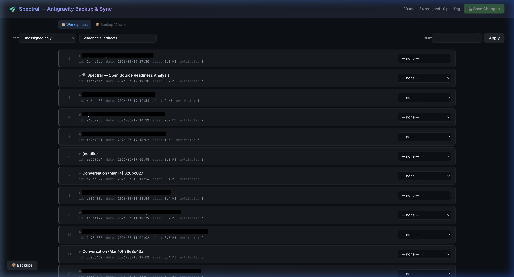
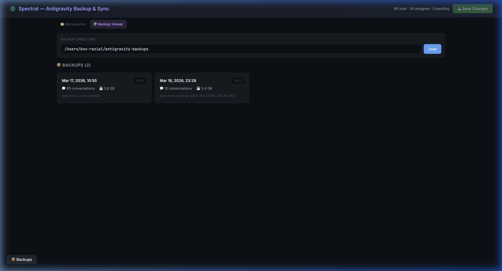
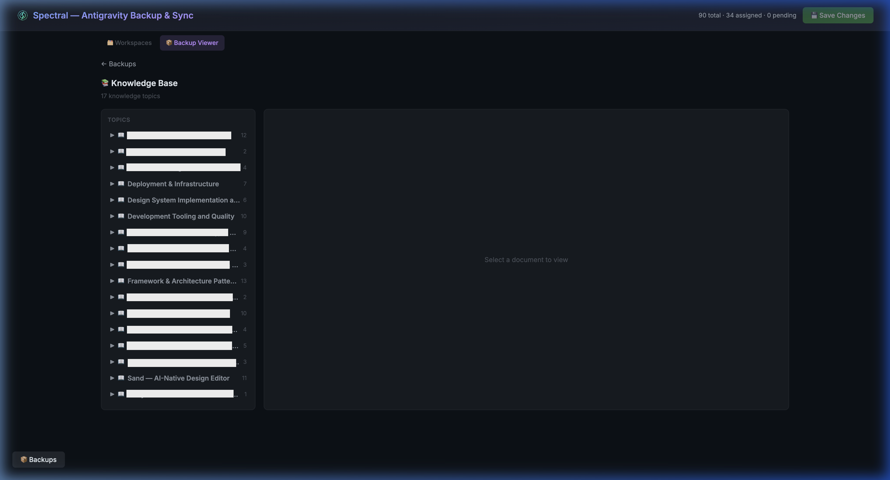
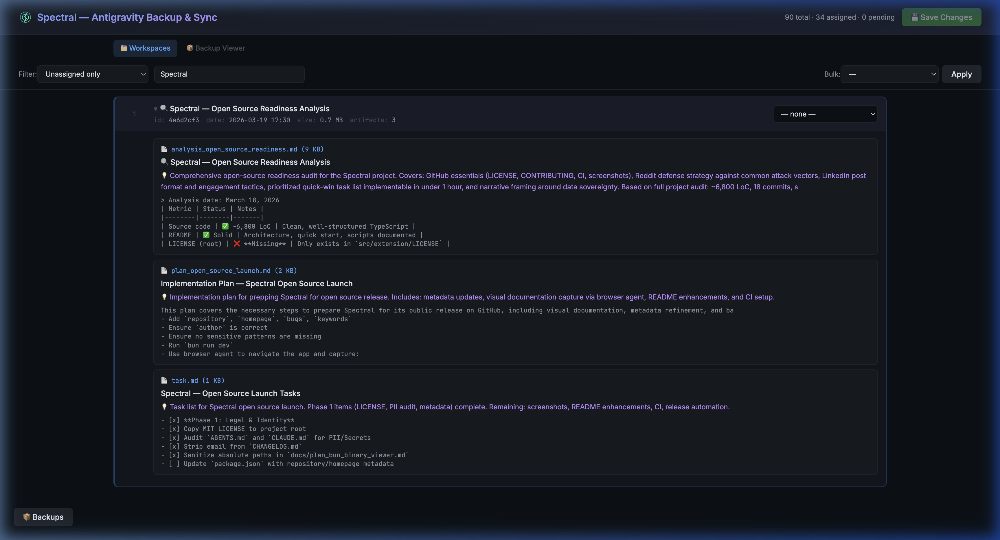

# ⚡ Spectral Curiosity

[](LICENSE)
[](https://www.typescriptlang.org/)
[](https://bun.sh)

**Your AI conversations are your data.** Spectral is a zero-dependency tool to backup, explore, search, and manage your [Antigravity](https://antigravity.dev) AI conversation workspace associations — so you can always access your context, no matter which tool you use tomorrow.

Runs as a **Bun full-stack app** or as a **VS Code / Antigravity extension**.



---

## Why Spectral?

If you use AI coding assistants, your conversation history is valuable context — architectural decisions, debugging sessions, domain knowledge. But that context can silently disconnect from your project, or become inaccessible if you switch tools.

Spectral was born to solve two problems:

1. **Conversations disconnect from projects** — Spectral detects orphaned conversations and lets you reassign them.
2. **Data portability** — Spectral backs up your conversations to portable formats you can read without any specific AI tool installed.

---

## Features

- 📂 **Auto-detects workspaces** from Antigravity's sidebar database
- 🔍 **Search & filter** conversations by title, artifacts, workspace, or status
- 🔄 **Reassign** conversations to different workspaces (with protobuf encoding)
- 📝 **View AI artifacts** — summaries, content previews, and metadata
- ➕ **Add new workspaces** for assignment
- 💾 **Save changes** back to the Antigravity database (with automatic backups)
- 🔐 **Cross-platform** — macOS, Linux, and Windows

## Stack

| Layer    | Technology                  |
|----------|------------------------------|
| Runtime  | [Bun](https://bun.sh) 1.3+  |
| Frontend | React 19                     |
| Backend  | `Bun.serve()` (routes API)   |
| Database | `bun:sqlite` / `node-sqlite3-wasm` |
| Linting  | Biome 2                      |
| Types    | TypeScript 5.9 (strict)      |
| HMR      | Built-in (Bun)               |

## Quick Start

```bash
# Install dependencies
bun install

# Start dev server (API + React SPA + HMR on port 3000)
bun run dev
```

Open [http://localhost:3000](http://localhost:3000)

### Extension

```bash
# Build the VS Code / Antigravity extension
bun run build:ext

# Package as .vsix
cd src/extension && npx vsce package

# Install in Antigravity
antigravity --install-extension src/extension/spectral-extension-0.1.0.vsix
```

## Scripts

```bash
bun run dev        # Start full-stack dev server with HMR
bun run build      # Production build → dist/
bun run build:ext  # Install extension deps + build
bun run watch:ext  # Extension watch mode (dev)
bun run check      # Run typecheck + lint
bun run typecheck  # TypeScript strict type checking
bun run lint       # Biome lint
bun run lint:fix   # Biome lint + auto-fix
bun run format     # Biome format
```

## Project Structure

```
spectral-curiosity/
├── AGENTS.md              # Universal AI agent context
├── CLAUDE.md              # Claude-specific context
├── src/
│   ├── client/            # React UI
│   │   ├── App.tsx        # Main React component
│   │   ├── api.ts         # Environment-aware API (fetch / postMessage)
│   │   ├── main.tsx       # Entry point
│   │   ├── index.css      # Tailwind CSS v4 theme + keyframes
│   │   ├── components/    # React components (co-located folders)
│   │   │   ├── BackupPanel/
│   │   │   ├── BackupViewer/
│   │   │   ├── ConversationCard/
│   │   │   ├── Header/       # Header + FilterBar
│   │   │   └── Toast/
│   │   └── hooks/         # Custom hooks (useConversations, useBackups)
│   ├── shared/            # Shared data layer (platform-agnostic)
│   │   ├── database.ts    # DbAdapter interface
│   │   ├── types.ts       # Shared TypeScript types
│   │   ├── assignments.ts # Workspace assignment logic
│   │   ├── backups.ts     # Backup listing & diffs
│   │   ├── backup-format.ts    # Backup format constants/parsers
│   │   ├── backup-reader.ts    # Full backup reader implementation
│   │   ├── backup-reader-types.ts # Backup reader type definitions
│   │   ├── conversations.ts # Conversation loading
│   │   ├── protobuf.ts    # Protobuf encoding/decoding
│   │   ├── paths.ts       # Cross-platform path constants
│   │   ├── trajectories.ts # Trajectory entry parsing
│   │   ├── trajectory-types.ts # Extended trajectory types
│   │   └── workspaces.ts  # Workspace management
│   ├── server/            # Bun API server
│   │   ├── index.ts       # Bun.serve() — API routes + React SPA
│   │   ├── adapter.ts     # DbAdapter impl (bun:sqlite)
│   │   └── routes/
│   │       └── backup-viewer.ts # Backup viewer route handler
│   └── extension/         # VS Code / Antigravity extension
│       ├── extension.ts   # Extension entry point
│       ├── SpectralPanel.ts # Webview panel
│       ├── messageHandler.ts # Webview ↔ host message router
│       ├── adapter.ts     # DbAdapter impl (node-sqlite3-wasm)
│       ├── esbuild.mjs    # Extension build config
│       ├── package.json   # Extension manifest
│       ├── tsconfig.json  # Extension TypeScript config
│       └── sdk/           # Extension SDK modules
│           ├── sqlite-loader.ts   # Centralized SQLite loader (⚠️)
│           ├── backup-engine.ts   # Full/incremental backup orchestration
│           ├── backup-estimator.ts # Backup size estimation
│           ├── backup-scheduler.ts # Auto-backup intervals
│           ├── connection.ts      # Connection management
│           ├── markdown-export.ts # Markdown export
│           ├── sdk-manager.ts     # Antigravity SDK lifecycle
│           ├── ls-client.ts       # Language Server RPC client
│           └── ls-types.ts        # Language Server types
├── index.html             # HTML entry (Bun HTML import)
├── biome.json             # Biome linter/formatter config
├── tsconfig.json          # Root TypeScript config
└── package.json           # Root dependencies & scripts
```

### Architecture

The `src/shared/` module provides a **`DbAdapter` interface** that abstracts SQLite access. Both the Bun server (`bun:sqlite`) and the VS Code extension (`node-sqlite3-wasm`) inject their own implementation at startup. This eliminates code duplication while supporting both runtimes.

```
client (React) ─── shared (data layer) ─┬─ server/adapter.ts  (bun:sqlite)
                                         └─ extension/adapter.ts (node-sqlite3-wasm)
```

## How It Works

1. Reads Antigravity's `state.vscdb` SQLite database to find conversations and workspace associations
2. Parses protobuf-encoded conversation metadata (titles, workspace URIs)
3. Scans the `~/.gemini/antigravity/brain/` directory for AI-generated artifacts
4. Presents everything in a searchable, filterable React UI
5. Allows reassigning conversations — writes modified protobuf back to the database

### Backup Viewer

Browse, search, and inspect your backed-up conversations — even on a machine without Antigravity installed.



### Knowledge Base Explorer

Visualize the knowledge items Antigravity distills from your conversations.



### Workspace Details

Expand any conversation to see its artifacts, metadata, and content previews.



## Adding Workspaces

Click **+ Workspace** in the filter bar and provide:
- **Name** — Display name (e.g., `my-project`)
- **URI** — Full path (e.g., `~/projects/my-project`)

Workspaces are saved to `~/.gemini/antigravity/spectral-workspaces.json`.

## License

MIT
