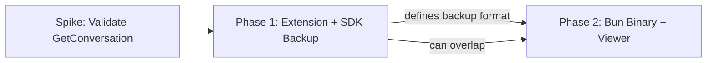

# Spectral — Roadmap

## Vision

Spectral evolves from a workspace manager into a **complete data sovereignty tool** for Antigravity users — enabling automated conversation backup, full data export, and post-migration viewing.

---

## Current State (v0.1.0)

- ✅ Auto-detect workspaces from `state.vscdb`
- ✅ Search & filter conversations
- ✅ Reassign conversations to workspaces (protobuf write)
- ✅ View AI artifacts (brain/ directory)
- ✅ Dual runtime: Bun server + VS Code/Antigravity extension
- ✅ `DbAdapter` pattern for cross-runtime SQLite

---

## Phase 1: Extension SDK Integration + Automated Backup

> **Plan:** [plan_extension_sdk_backup.md](./plan_extension_sdk_backup.md)

Integrate the community [antigravity-sdk](https://github.com/Kanezal/antigravity-sdk) into the Antigravity extension to unlock conversation content access and real-time event monitoring. Build an automated backup system that exports conversations to a portable, human-readable format.

### Goals

- Extract full conversation content via `LSBridge.getConversation()`
- Automated backup (event-driven + interval, configurable)
- Export to JSON + Markdown (portable, searchable)
- Include brain/ logs, Knowledge Items, skills, and workflows
- User-configurable settings (path, strategy, retention)

### Key Dependency

Requires a **spike/POC** to validate that the Language Server's `GetConversation` RPC method returns full message content.

---

## Phase 2: Standalone Binary + Backup Viewer

> **Plan:** [plan_bun_binary_viewer.md](./plan_bun_binary_viewer.md)

Compile Spectral into a standalone executable binary with `bun build --compile`. Add a Backup Viewer UI that lets users navigate, search, and read their exported conversations without Antigravity installed.

### Goals

- `bun build --compile` for macOS, Linux, Windows
- Backup Viewer UI: browse exported conversations, search, filter
- Works completely standalone — no Bun, no Node, no Antigravity
- Cross-platform distribution (GitHub Releases / npm)

### Relationship to Phase 1

Phase 2 **consumes** the backup format defined in Phase 1. The two phases can overlap in development but the backup format contract must be finalized first.

---

## Phase Sequence

---

## Future Ideas (Unplanned)

- 🔄 Incremental backup (diff-based, only new/changed conversations)
- 📊 Usage analytics dashboard (tokens, models, step counts)
- 🔍 Full-text search across all backed-up conversations
- 🌐 Export to other formats (Obsidian vault, Notion, etc.)
- 🔗 Integration with other AI IDEs (Cursor, Windsurf)
